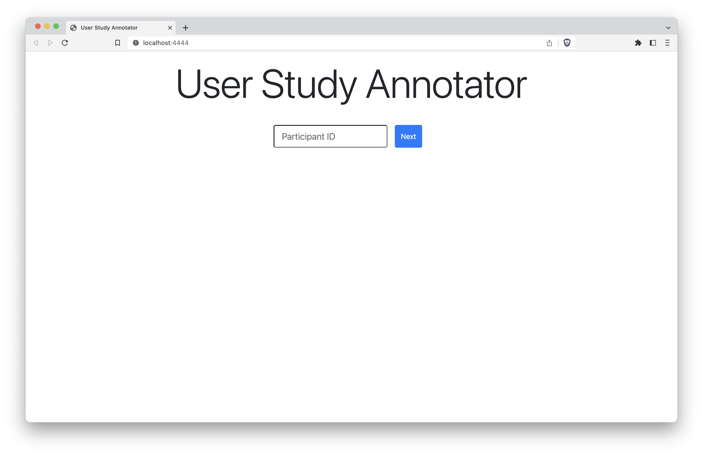

# User Study Annotator
A minimal, hackable annotator for user studies. Originally created for [_SAMoSA_ (IMWUT/Ubicomp 2022)](https://vimal-mollyn.com/research/samosa-sensing-activities-with-motion-and-sub-sampled-audio/).


## What's it good for?
Anytime you need to manually annotate user sensor data. For example, IMU data from smartwatches, smartphones, etc. This tool will log unix timestamps to a csv, which can later be synced to sensor data.

### How does it work?
The tool randomly presents an activity and context, given a set of [contexts with corresponding activities](static/activity_list.json). First, a context is chosen at random, and then the trials of all the activities pertaining to that context are randomized. For example, in the workshop context, the 15 trials (5 activities × 3 repetitions per activity) are presented in a random order. 

### Features
- Redo Trials - You (the experimenter) will inevitably make a mistake! 
- Save progress - user study progress is stored in `study_data/pid/p_state.json`, so you can restart whenever you want to!
- Timer - in order to make sure you collect enough data! :D

## How to use?
Tested with python3.8  

### 1. Run
```
python app.py 
```

### 2. Enter a participant ID
Make sure it's a number - this is used as the random seed! 


### 3. Collect data!


## I want a different set of labels
Modify `static/activity_list.json`.

## Dependencies
```
flask
```
